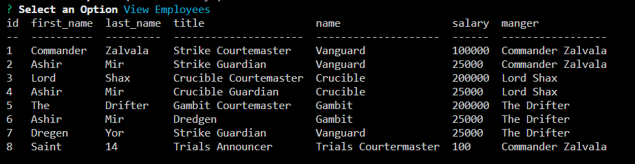

# CLI-Employee-Management

This is a simple CLI application for making CRUD operations with mySQL database

## Objective

- Create mySQL schema for creating a companies employees, roles, and departments
- Create Inquirer prompts for navigating database
- Write mySQL queries to make CRUD operations

## Installation

- Clone this repo to your local machine
- Use your terminal to navigate to the root folder and run 'npm i' to install the necessary packages
- Use a SQL workbench, such as [MySQL Workbench](https://www.mysql.com/products/workbench/) to create a database with your name of choice
- Update config/connection so that host, port, user, password, and database match your workbench settings
- In your terminal, run 'npm start' to use the application

## Outcome

This is a rather bare bones application and I'd like to make it more robust in the future. It was nice learning how to make CRUD operations without an ORM but Sequelize will definitely be used in the future 😅

## Technology

This application relies on console.table, dotenv, inquirer, and mysql packages

## License

- This project is [MIT](https://choosealicense.com/licenses/mit/) licensed

This application was authored by [Diego Hernandez](https://github.com/Diegopie)
